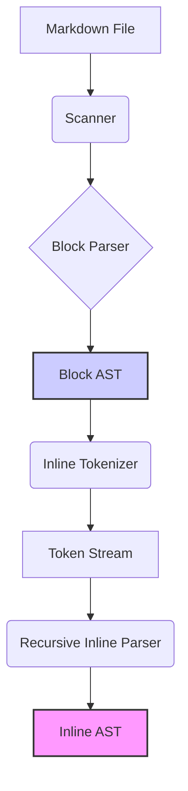

## mdfix

## Українська версія

### Призначення

`mdfix` — це CLI-інструмент для аналізу, перевірки та автоматичного виправлення Markdown-документів відповідно до визначених правил.

Проєкт використовує структурний підхід до обробки документів через побудову моделей документа та AST замість прямої текстової заміни. Основна мета — створити безпечний, розширюваний та передбачуваний інструмент для підтримки якості Markdown-документів.

### Поточний статус

**Версія:** 0.8.3  
**Статус:** Розробка ядра діагностики (Linting Core).  

Реалізовано:

* **Scanner:** Рекурсивний пошук `.md` файлів з фільтрацією технічних директорій (`.git`, `__pycache__`, `.pytest_cache`).
* **Parser:** Базовий блоковий парсер (Headings, Paragraphs, Lists, Tables, Code Blocks) з інтеграцією Inline Parser'а.
* **Inline AST:** Повноцінна підтримка вкладених елементів (`Strong`, `Emphasis`, `Links`) всередині блоків тексту.
* **Diagnostics Engine:** Модель даних `Diagnostic` та базовий рушій правил `Linter`.
* **Table Formatter:** Окремий модуль форматування таблиць (готовий до інтеграції в CLI).
* **Tests:** Понад 135 автоматизованих тестів (Unit & Integration).

Заплановано (Milestone 1):

* Перші реальні правила літингу (MD001 Heading Skip, MD009 Trailing Whitespace).
* Команда CLI `mdfix lint <path>`.
* Вивід результатів у консоль (Text/JSON).

### Архітектура

Поточний pipeline обробки:



1. **Scanner:** Знаходить файли.
2. **Block Parser:** Читає файл і будує дерево блокових елементів (`Document.elements`).
3. **Inline Integration:** Під час парсингу абзаців та заголовків автоматично викликається `inline_parser`, який будує структуру внутрішнього тексту (жирний шрифт, курсив, посилання).
4. **Linter:** Пройдеться по готовому AST і застосовує зареєстровані правила, генеруючи список помилок (`List[Diagnostic]`).

Детальний опис дизайну Inline AST: [docs/INLINE_AST_DESIGN.md](docs/INLINE_AST_DESIGN.md)

### Заплановані можливості (Roadmap)

* **Milestone 1 (Current):** Ядро діагностики. Правила MD0xx. Команда `lint`.
* **Milestone 2:** Система автофіксів (`mdfix fix`). Інтеграція форматера таблиць. Генерація Diff.
* **Milestone 3:** Стабілізація, CI/CD, реліз v1.0.0-beta.

### Встановлення

Розробницьке встановлення:

```bash
git clone https://github.com/ricci-git/mdfix.git
cd mdfix
python -m venv .venv
source .venv/bin/activate  # Linux/macOS
# .venv\Scripts\activate   # Windows
pip install -e ".[dev]"
```

### Використання

Сканування Markdown-файлів:

```bash
mdfix scan .
```

Перевірка версії:

```bash
mdfix version
```

*(Команди `lint` та `fix` будуть доступні після завершення Milestone 1).*

### Розробка

Запуск тестів:

```bash
pytest
```

Перевірка стилю коду:

```bash
ruff check .
```

Автофікс стилю:

```bash
ruff check --fix .
```

### Структура проєкту

```text
mdfix/
├── cli.py              # Інтерфейс командного рядка
├── document.py         # Модель Document
├── elements.py         # Моделі блокових елементів AST
├── diagnostics.py      # Модель Diagnostic та Severity
├── linter.py           # Рушій виконання правил
├── parser.py           # Головний парсер (Block + Inline integration)
├── inline_parser.py    # Парсер inline-токенів
├── inline_tokens.py    # Лексичні токени
├── inline_elements.py  # Моделі inline-елементів AST
├── table_formatter.py  # Модуль форматування таблиць
├── scanner.py          # Пошук файлів
└── version.py          # Версія пакета

tests/
├── test_diagnostics.py
├── test_linter.py
├── test_parser_integration.py
├── test_scanner.py
├── test_table_formatter.py
└── ...                 # Інші unit-тести компонентів
```

### Принципи дизайну

1. **Small isolated components:** Кожен модуль має чітку зону відповідальності.
2. **Test-driven development (TDD):** Спочатку тест, потім код.
3. **Explicit document structure:** Робота зі структурованими даними (AST), а не сирими рядками.
4. **Safe automated modifications:** Будь-які зміни мають бути попередньо переглянуті або гарантовано ідемпотентними.
5. **Extensible validation rules:** Легкість додавання нових правил літингу.
6. **Documentation as code:** Документація синхронізується зі станом репозиторію.

### Ліцензія

MIT License

---

## English Translation

## en mdfix

### Purpose

`mdfix` is a CLI tool for analyzing, validating, and automatically fixing Markdown documents according to predefined rules.

The project uses a structured document processing approach based on document models and AST instead of direct text replacement. The main goal is to provide a safe, extensible, and predictable tool for maintaining Markdown document quality.

### Current Status

**Version:** 0.8.3  
**Status:** Developing Diagnostics Core (Linting Core).  

Implemented:

* **Scanner:** Recursive search for `.md` files with filtering of technical directories (`.git`, `__pycache__`, `.pytest_cache`).
* **Parser:** Basic block parser (Headings, Paragraphs, Lists, Tables, Code Blocks) with integrated Inline Parser.
* **Inline AST:** Full support for nested elements (`Strong`, `Emphasis`, `Links`) inside text blocks.
* **Diagnostics Engine:** Data model `Diagnostic` and basic rule engine `Linter`.
* **Table Formatter:** Standalone table formatting module (ready for CLI integration).
* **Tests:** Over 135 automated tests (Unit & Integration).

Planned (Milestone 1):

* First real linting rules (MD001 Heading Skip, MD009 Trailing Whitespace).
* CLI command `mdfix lint <path>`.
* Output results to console (Text/JSON).

### Architecture

Current processing pipeline:

-*(See Mermaid diagram above)*

1. **Scanner:** Finds files.
2. **Block Parser:** Reads file and builds tree of block elements (`Document.elements`).
3. *Inline Integration:** During parsing of paragraphs and headings, `inline_parser` is automatically called to build internal text structure (bold, italic, links).
4. **Linter:** Iterates over the ready AST and applies registered rules, generating a list of errors (`List[Diagnostic]`).

Detailed design of Inline AST: [docs/INLINE_AST_DESIGN.md](docs/INLINE_AST_DESIGN.md)

### Planned Features (Roadmap)

* **Milestone 1 (Current):** Diagnostics Core. Rules MD0xx. Command `lint`.
* **Milestone 2:** Auto-fix system (`mdfix fix`). Table formatter integration. Diff generation.
* **Milestone 3:** Stabilization, CI/CD, release v1.0.0-beta.

### Installation

Development installation:

```bash
git clone https://github.com/ricci-git/mdfix.git
cd mdfix
python -m venv .venv
source .venv/bin/activate  # Linux/macOS
# .venv\Scripts\activate   # Windows
pip install -e ".[dev]"
```

### Usage

Scan Markdown files:

```bash
mdfix scan .
```

Check version:

```bash
mdfix version
```

*(Commands `lint` and `fix` will be available after completion of Milestone 1).*

### Development

Run tests:

```bash
pytest
```

Check code style:

```bash
ruff check .
```

Auto-fix style:

```bash
ruff check --fix .
```

### Project Structure

-*(Same as Ukrainian section)*

### Design Principles

1. **Small isolated components:** Each module has a clear area of responsibility.
2. **Test-driven development (TDD):** Test first, then code.
3. **Explicit document structure:** Working with structured data (AST), not raw strings.
4. **Safe automated modifications:** Any changes must be previewed or guaranteed idempotent.
5. **Extensible validation rules:** Ease of adding new linting rules.
6. **Documentation as code:** Documentation synchronizes with repository state.

### License

MIT License

---
**Version History:**

| Version | Date | Author | Changes |
| --- | --- | --- | --- |
| 1.0.0 | 2026-10-07 | Ricci/AI | Major update to reflect v0.8.3 state, added Linter/Diagnostics info, standardized metadata, added EN translation. |
| 0.7.0 | 2026-08-02 | Team | Initial public README. |
