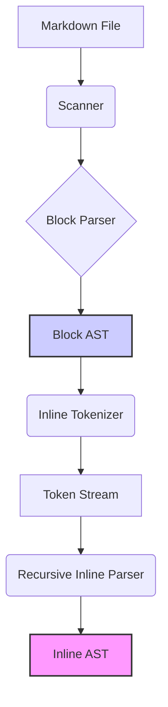

## Стан проєкту mdfix

## 0. Поточні пріоритети (Milestone 0: Repo Hygiene)

На даний момент фокус зміщено з функціональної розробки парсера на стабілізацію інфраструктури репозиторію. Без цього подальший розвиток ризикований через неузгодженість метаданих та шум у результатах аналізу.

### 0.1 Технічний борг (To Do)

1. **Синхронізація версій:** Версія в `pyproject.toml` (0.1.0) не відповідає `mdfix/version.py` (0.8.3). Необхідно налаштувати динамічне читання версії або синхронізувати вручну.
2. **Виключення сканера:** `mdfix/scanner.py` включає `.pytest_cache` та `__pycache__` у результати пошуку. Необхідно додати ці директорії до `DEFAULT_EXCLUDES`.
3. **Актуалізація README:** Файл `README.md` містить застарілу інформацію про кількість тестів та версію.

### 0.2 Критерії завершення Milestone 0

* Усі тести проходять (`pytest`).
* Лінер проходить (`ruff check .`).
* `mdfix scan .` не показує файлів з кеш-директорій.
* Метадані пакета (`pip show mdfix`) відповідають версії CLI.
* Документація (`PROJECT_STATE.md`, `README.md`) актуалізована.

---

## 1. Загальний стан

**Версія:** v0.8.3  
**Статус:** Стабільний прототип парсингу.  

Проєкт має робочий конвеєр розбору Markdown: від блоків до вкладених inline-елементів через токенізатор. Однак система ще не здатна діагностувати помилки чи автоматично виправляти документи (це цілі Milestone 1+).

## 2. Архітектурний обзор

### 2.1 Конвеєр обробки (Pipeline)

### 2.2 Компоненти

1. **Scanner**: Рекурсивний пошук `.md` файлів. *Проблема:* Потребує фільтрації технічних папок (Task 0.1.2).
2. **Block Parser**: Розпізнає заголовки, абзаци, списки, таблиці, код-блоки. Генерує `Block AST`.
3. **Inline Tokenizer**: Лексичний аналіз рядка всередині блоку. Повертає потік токенів. Відокремлений від побудови дерева.
4. **Recursive Inline Parser**: Побудова `Inline AST` з потоку токенів. Підтримує вкладеність (`**bold *italic***`) та послідовність елементів.
5. **Table Formatter**: Існує окремим модулем (`table_formatter.py`). Має базові тести, але **не інтегрований** у загальний ланцюжок обробки документу.

## 3. Виконані віхи (History)

| Версія | Назва | Основний результат |
| ------ | ----- | ------------------ |
| v0.7.0 | Inline AST Foundation | Моделі Text, Strong, Emphasis, Link, Code. Інтеграція в Paragraph. |
| v0.7.1-v0.7.8 | Basic Inline Parsing | Послідовне додавання підтримки маркерів (`**`, `*`, ` `[]``()`), рефакторинг helper-функцій. |
| v0.8.1 | Inline Tokenizer | Виділення лексичного шару. Токенізація без AST. |
| v0.8.2 | Recursive Parsing | Перехід на рекурсивний парсер токенів. Підтримка глибокої вкладеності. |
| v0.8.3 | Sequential Elements | Гарантія порядку слідування inline-елементів. Збереження тексту між ними. |

## 4. Дорожня карта (Roadmap)

### Milestone 0: Гігієна репозиторію (Поточний етап)

* Синхронізація версій.
* Фікс сканера.
* Оновлення документації.

### Milestone 1: Ядро Діагностики (Linting Core)

* Модель `Diagnostic` (dataclass/pydantic).
* Rule Engine (реєстр правил, visitor pattern).
* Інтеграція Inline AST у Block Parser (щоб правила бачили структуру тексту).
* Перші правила: MD001 (Heading Skip), MD009 (Trailing Whitespace).
* CLI команда `mdfix lint`.

### Milestone 2: Автофікси та Таблиці

* Механізм генерації Diff/Patch.
* Інтеграція `table_formatter` у процес фіксації.
* Команда `mdfix fix --dry-run`.
* Правило форматування таблиць.

### Milestone 3: Стабілізація та Реліз MVP

* E2E тести CLI.
* Повна документація користувача (RULES.md).
* CI/CD пайплайн.
* Реліз v1.0.0-beta.

## 5. Відомі обмеження (Known Limitations)

* **Немає Linting:** Програма не може повідомити про помилки, тільки розібрати текст.
* **Таблиці ізольовані:** Форматувальник таблиць не викликається автоматично при парсингу.
* **Edge Cases:** Складні конструкції Markdown (footnotes, HTML-in-MD, complex escapes) можуть парситися некоректно або не підтримуватися поки що.

---

## English Translation

## Project State of mdfix

## 0. Current Priorities (Milestone 0: Repo Hygiene)

The focus has currently shifted from functional parser development to stabilizing the repository infrastructure. Without this, further development is risky due to inconsistent metadata and noise in analysis results.

### 0.1 Technical Debt (To Do)

1. **Version Synchronization:** The version in `pyproject.toml` (0.1.0) does not match `mdfix/version.py` (0.8.3). Dynamic version reading or manual synchronization is required.
2. **Scanner Exclusions:** `mdfix/scanner.py` includes `.pytest_cache` and `__pycache__` in search results. These directories must be added to `DEFAULT_EXCLUDES`.
3. **README Update:** The `README.md` file contains outdated information regarding test counts and versions.

### 0.2 Milestone 0 Completion Criteria

* All tests pass (`pytest`).
* Linter passes (`ruff check .`).
* `mdfix scan .` does not show files from cache directories.
* Package metadata (`pip show mdfix`) matches the CLI version.
* Documentation (`PROJECT_STATE.md`, `README.md`) is updated.

---

## 1. General Status

**Version:** v0.8.3  
**Status:** Stable parsing prototype.  

The project has a working Markdown parsing pipeline: from blocks to nested inline elements via a tokenizer. However, the system is not yet capable of diagnosing errors or automatically fixing documents (these are goals for Milestone 1+).

## 2. Architectural Overview

### 2.1 Processing Pipeline

-*(Same diagram as above)*

### 2.2 Components

1. **Scanner**: Recursive search for `.md` files. *Issue:* Needs filtering of technical folders (Task 0.1.2).
2. **Block Parser**: Recognizes headings, paragraphs, lists, tables, code blocks. Generates `Block AST`.
3. **Inline Tokenizer**: Lexical analysis of the string inside a block. Returns a token stream. Separated from tree building.
4. **Recursive Inline Parser**: Building `Inline AST` from the token stream. Supports nesting (`**bold *italic***`) and element sequence.
5. **Table Formatter**: Exists as a separate module (`table_formatter.py`). Has basic tests but is **not integrated** into the general document processing chain.

## 3. Completed Milestones (History)

| Version | Name | Key Result |
| ------- | ---- | ---------- |
| v0.7.0 | Inline AST Foundation | Models for Text, Strong, Emphasis, Link, Code. Integration into Paragraph. |
| v0.7.1-v0.7.8 | Basic Inline Parsing | Sequential addition of support for markers (`**`, `*`, ` `[]`,`()`), refactoring of helper functions. |
| v0.8.1 | Inline Tokenizer | Extraction of the lexical layer. Tokenization without AST. |
| v0.8.2 | Recursive Parsing | Transition to a recursive token parser. Support for deep nesting. |
| v0.8.3 | Sequential Elements | Guarantee of inline element ordering. Preservation of text between them. |

## 4. Roadmap

### Milestone 0: Repository Hygiene (Current Stage)

* Version synchronization.
* Scanner fix.
* Documentation update.

### Milestone 1: Diagnostics Core (Linting Core)

* `Diagnostic` model (dataclass/pydantic).
* Rule Engine (rule registry, visitor pattern).
* Integration of Inline AST into Block Parser (so rules can see text structure).
* First rules: MD001 (Heading Skip), MD009 (Trailing Whitespace).
* CLI command `mdfix lint`.

### Milestone 2: Auto-fixes & Tables

* Diff/Patch generation mechanism.
* Integration of `table_formatter` into the fixing process.
* Command `mdfix fix --dry-run`.
* Table formatting rule.

### Milestone 3: Stabilization & MVP Release

* E2E CLI tests.
* Full user documentation (RULES.md).
* CI/CD pipeline.
* Release v1.0.0-beta.

## 5. Known Limitations

* **No Linting:** The program cannot report errors, only parse text.
* **Isolated Tables:** The table formatter is not called automatically during parsing.
* **Edge Cases:** Complex Markdown constructs (footnotes, HTML-in-MD, complex escapes) may be parsed incorrectly or unsupported for now.

---
**Version History:**

| Version | Date       | Author      | Changes                                                                 |
|---------|------------|-------------|-------------------------------------------------------------------------|
| 2.1     | 2026-10-07 | Ricci/AI    | Added Milestone 0 priorities, standardized metadata, clarified roadmap. |
| 2.0     | 2026-10-07 | Ricci       | Updated state for v0.8.3.                                               |
| 1.0     | 2026-08-02 | Team        | Initial project state tracking.                                         |
